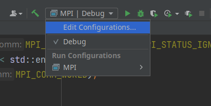
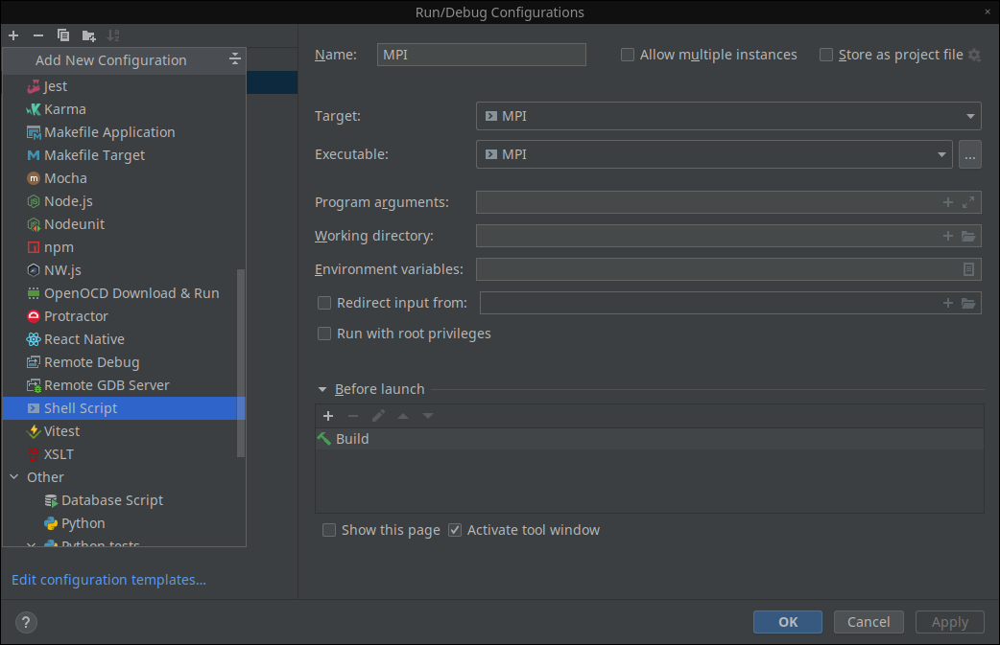
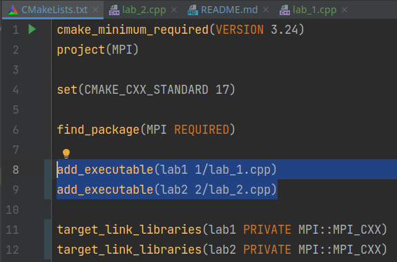
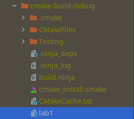
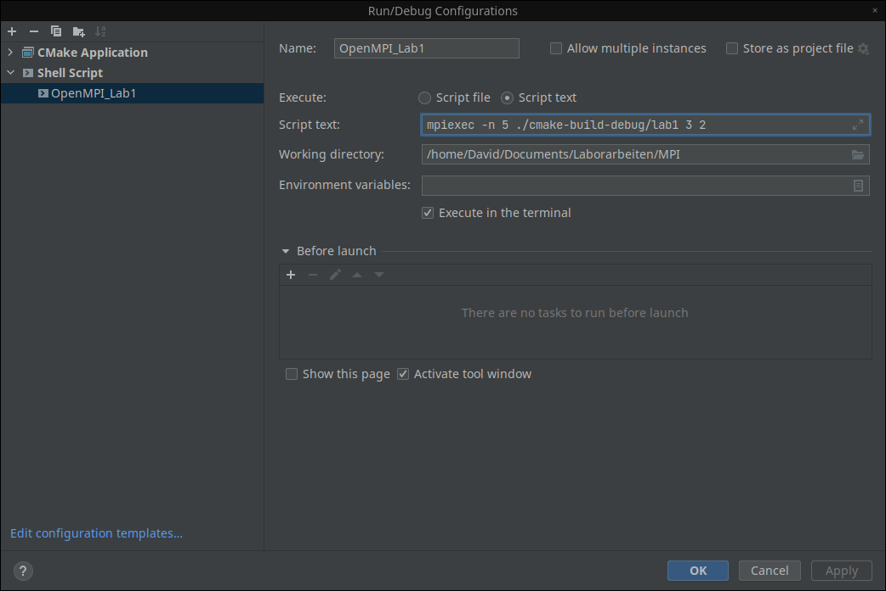
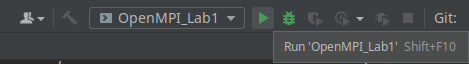

# OpenMPI MIET

Данный репозиторий представляет из себя лабораторные работы
по дисциплине "Технологии параллельного программирования"
в ВУЗ "МИЭТ"

- [Установка OpenMPI Linux в CLion](#установка-openmpi-в-clion-на-linux-)
- [Запуск программы через терминал](#запуск-программы-через-терминал-)
- [Создание конфигурации в Clion для запуска программы](#создание-конфигурации-в-clion-для-запуска-программы)

## Установка OpenMPI в CLion на linux:

### Установите OpenMPI в систему:

```shell
sudo apt-get install libopenmpi-dev
```

### Добавьте конфигурацию в `CMakeLists.txt`

Перед `add_executable` вставьте

```Cmake 
find_package(MPI REQUIRED)
```

После

```Cmake 
target_link_libraries(Name_Project PRIVATE MPI::MPI_CXX)
```

## Запуск программы через терминал:

### На примере 1-ой лабораторной работы

- mpiexec -n 5 указывает количество процессов (5 в данном случае)
- ./program_name - имя исполняемого файла вашей программы
- 3 - количество повторений цикла (M)
- 2 - количество крайних процессов (N).

```shell
mpiexec -n 5 ./program_name 3 2
```

## Создание конфигурации в Clion для запуска программы

___

- ### **Шаг 1**



- ### **Шаг 2**



- ### **Шаг 3**

___ 

1. #### Указываем путь до исполняемого файла который определен в `CmakeLists.txt`




2. #### Задаем аргументы



3. #### Запускаем

